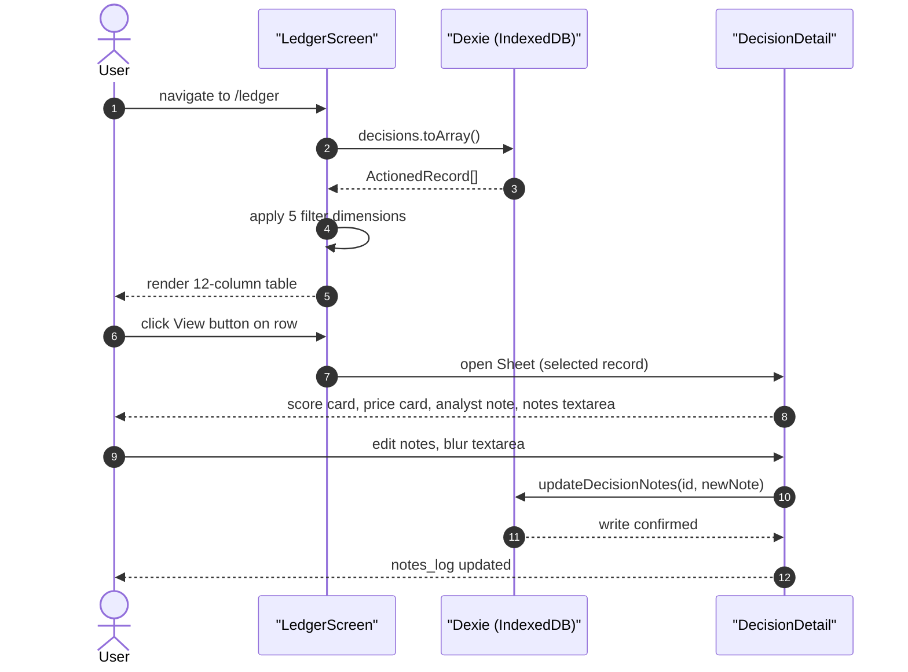

**Size: L**

## Summary

Built the Decision Ledger screen (`/ledger` route) from scratch: a 12-column table rendering all saved decisions from IndexedDB, 5 filter dimensions, and a right-side Sheet drawer (`DecisionDetail`) showing the original analysis snapshot with editable notes. Simultaneously extended the `ActionedRecord` type with 5 new fields and bumped the Dexie schema through two migrations (v4 and v5).

---

## Problem Being Solved

The inbox workflow could move items to a ledger, but there was no screen to review past decisions. Users had no way to see the original analysis (score, price, analyst note) at the time of a decision, filter their history, or add follow-up notes after the fact. The `ActionedRecord` type also lacked the fields needed to support those views.

---

## Architecture — Before & After

| Aspect | Before | After |
|--------|--------|-------|
| Decision Ledger screen | Did not exist | `/ledger` route — `LedgerScreen.tsx` |
| Decision detail view | None | `DecisionDetail.tsx` — Sheet drawer, opens on View button click |
| `ActionedRecord` fields | `ticker`, `band`, `signal`, `decision`, `actioned_at`, `notes`, `followup_at` | + `sub_type`, `decision_label`, `score_at_decision`, `price_at_decision`, `notes_log[]` |
| Dexie schema version | v3 | v5 (two-step migration) |
| Follow-up status | Stored as raw `followup_at` date string | Computed at read time: `Pending` / `Overdue` / `N/A` |
| InboxScreen moveToLedger() | Wrote minimal record (no new fields) | Populates all 5 new required fields before write |

---

## Data Model Contract — ActionedRecord (extended)

Five fields were added to `ActionedRecord` in `src/lib/types.ts`:

| Field | Type | Notes |
|-------|------|-------|
| `sub_type` | `Strategy` | Reuses the existing `Strategy` union: `"Cash-Secured Put" \| "Long Equity" \| "Covered Call"` |
| `decision_label` | `DecisionLabel` | Reuses the existing `DecisionLabel` union: `"Accepted" \| "Rejected" \| "Modified" \| "Watch Only" \| "Closed" \| "Lesson Learned"` |
| `score_at_decision` | `number` | Composite score captured at the moment of the decision |
| `price_at_decision` | `number` | Price captured at the moment of the decision |
| `notes_log` | `string[]` | Append-only log; each call to `updateDecisionNotes()` pushes a new entry |

`followup_at` was already on the type — no schema change to that field.

---

## Dexie Schema Migrations

`src/lib/db.ts` defines two new schema versions:

### v4 — field defaults migration

Runs `upgrade()` on existing records in the `decisions` table. Fills in defaults for any record missing the new fields:

- `sub_type` → `"Long Equity"`
- `decision_label` → `"Accepted"`
- `score_at_decision` → `0`
- `price_at_decision` → `0`
- `notes_log` → `[]`

This ensures existing records are readable by the new UI without throwing on missing fields.

### v5 — followup status index

Adds a compound index on the `followup` table keyed on a computed status value. This index backs the "Follow-up Status" filter dimension (Pending / Overdue / N/A) without requiring a full-table scan on every filter change.

### Migration path for existing data

Any user who already has records in IndexedDB will have those records upgraded automatically when the app loads and Dexie detects the version mismatch. No manual intervention is required. The `mock-cowork.ts` seed key was bumped to `v3` so the 5 new mock records are seeded fresh on first load after upgrade.

---

## New Components

### LedgerScreen (`src/components/Ledger/LedgerScreen.tsx`)

Full rewrite of the prior stub. Key API surface:

- Reads all records from `db.decisions.toArray()` on mount.
- Applies 5 client-side filter dimensions in sequence:
  1. Asset Class
  2. Type (`ledger` / `followup`)
  3. Decision Label
  4. Strategy (Sub-Type)
  5. Follow-up Status (`N/A` / `Pending` / `Overdue`)
- Renders a 12-column table. Column order: Ticker, Asset Class, Band, Signal, Strategy, Decision Label, Score at Decision, Price at Decision, Decision Notes (truncated to 60 chars), Follow-up Status, Actioned Date, View.
- The View column renders a button per row. Clicking sets the selected record in local state, which opens the `DecisionDetail` sheet.

The Date Range filter dimension was deferred (see Caveats below).

### DecisionDetail (`src/components/Ledger/DecisionDetail.tsx`)

New component, created from scratch. Renders as a Radix UI `Sheet` drawer anchored to the right side of the viewport. Receives the selected `ActionedRecord` as a prop.

Sections rendered inside the drawer:

| Section | Source field |
|---------|-------------|
| Score card | `score_at_decision` |
| Price card | `price_at_decision` |
| Analyst note | `notes` (original decision note) |
| Suggested action | `signal` |
| Decision Notes textarea | `notes` — editable, auto-saves on blur |
| Notes log history | `notes_log[]` — read-only, chronological |

---

## updateDecisionNotes() Helper Contract

Defined in `src/lib/db.ts`:

```ts
updateDecisionNotes(id: number, newNote: string): Promise<void>
```

- Reads the current record by `id`.
- Appends `newNote` to `notes_log[]`.
- Sets `notes` to `newNote` (replaces the primary notes field).
- Writes back via `db.decisions.update(id, { notes, notes_log })`.

This is the only write path for notes after a record lands in the ledger. `InboxScreen.moveToLedger()` sets the initial `notes` value; all subsequent edits go through `updateDecisionNotes()`.

---

## InboxScreen Integration

`src/components/Inbox/InboxScreen.tsx` — `moveToLedger()` function updated to populate all 5 new required fields when writing a record to the `decisions` table:

- `sub_type` — sourced from the inbox item's strategy field.
- `decision_label` — sourced from the user's decision selection in the inbox UI.
- `score_at_decision` — captured from the current composite score on the inbox item at the time of action.
- `price_at_decision` — captured from the current price on the inbox item at the time of action.
- `notes_log` — initialised to `[]`.

Any call to `moveToLedger()` that does not supply these fields will produce a TypeScript compile error (all fields are required on `ActionedRecord`).

---

## Component Interaction Flow


_Data flow from IndexedDB read through filter rendering to notes write-back._

---

## File Changes

| File | Change type | What changed |
|------|-------------|-------------|
| `src/lib/types.ts` | Extended | Added `sub_type`, `decision_label`, `score_at_decision`, `price_at_decision`, `notes_log[]` to `ActionedRecord` |
| `src/lib/db.ts` | Extended | Dexie schema v4 (migration) + v5 (followup index) + `updateDecisionNotes()` + follow-up workflow helpers |
| `src/data/mock-cowork.ts` | Extended | 5 mock decisions (3 ledger-type + 2 followup-type) with all new fields; seed key bumped to v3 |
| `src/components/Ledger/LedgerScreen.tsx` | Rewrite | 12-column table, 5 filter dimensions, View button wiring |
| `src/components/Ledger/DecisionDetail.tsx` | New | Sheet drawer — score/price cards, analyst note, editable notes, notes_log history |
| `src/components/Inbox/InboxScreen.tsx` | Updated | `moveToLedger()` populates all 5 new required fields |

---

## Risk and Rollback

**Schema migration risk:** Dexie v4 `upgrade()` mutates existing records in place. If the migration is interrupted mid-run (e.g. browser tab closed), Dexie's transaction guarantees will roll the entire upgrade back — no partial writes. Records remain at v3 until the next successful open.

**Type safety:** All 5 new `ActionedRecord` fields are required (not optional). Any code path that writes to the `decisions` table without supplying them will fail at compile time, not silently at runtime.

**Rollback:** Revert commits `76dd38c` and `e8db27e`. If the user has already upgraded their local IndexedDB to v4/v5, the reverted code will fail to open the DB (version mismatch). The user would need to clear IndexedDB manually (DevTools → Application → IndexedDB). Since this is a local prototype with mock data, data loss is acceptable.

---

## Test Coverage — What to Verify

1. **Schema migration:** Open the app with an existing v3 IndexedDB. Confirm all records in the `decisions` table gain the 5 new fields with correct defaults after upgrade.
2. **LedgerScreen rendering:** Load the app with the mock-cowork seed. Confirm all 5 mock decisions appear in the table with correct column values.
3. **Filter dimensions:** Apply each of the 5 filters independently. Confirm the table narrows to matching rows only. Confirm clearing the filter restores all rows.
4. **Follow-up status computation:** Confirm a record with `followup_at` in the past shows `Overdue`; future date shows `Pending`; no `followup_at` shows `N/A`.
5. **DecisionDetail open/close:** Click View on a row. Confirm the correct record's score, price, analyst note, and signal render in the drawer. Close the drawer; confirm state resets.
6. **Notes edit and persistence:** Edit the Decision Notes textarea in the drawer. Blur the field. Reload the app. Confirm the new note appears as the primary note and in `notes_log[]`.
7. **InboxScreen → Ledger write:** Move an item from the inbox to the ledger. Confirm the resulting `ActionedRecord` in IndexedDB contains non-null `sub_type`, `decision_label`, `score_at_decision`, and `price_at_decision`.
