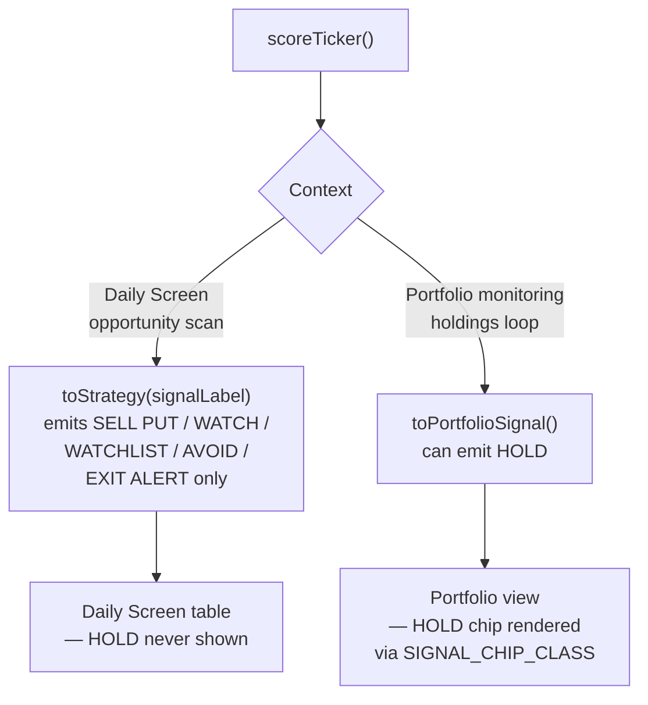

**Size: M**

## Summary

Formalised the `Theme`, `RuleSet`, `HOLD` signal, and `strategy` field contracts in `src/lib/types.ts`. The code that consumes these types (`mock-tickers.ts`, `scoring.ts`, `constants.ts`) was already written in the prior sprint; this ticket adds the compiler-level contracts that make that code statically safe and extensible.

---

## Problem Being Solved

The prior sprint shipped Theme strings, HOLD signal handling, and strategy derivation as ad hoc string literals with no central type definition. The compiler accepted any string where `Theme` or `SignalLabel` was expected, and there was no machine-checkable guarantee that all 11 themes were covered in lookup tables or that `HOLD` was only emitted in the portfolio monitoring context. This ticket closes those gaps.

---

## Architecture: Before and After

| Aspect | Before | After |
|---|---|---|
| `SignalLabel` union | 5 values: `SELL PUT`, `WATCH`, `WATCHLIST`, `AVOID`, `EXIT ALERT` | 6 values: adds `HOLD` (portfolio monitoring only) |
| `Theme` | No type — string literals in `mock-tickers.ts` | `Theme` union — 11 named market segments |
| `RuleSet` | No type | `RuleSet` interface: `{ id, includedThemes, minCompositeScore, excludedTickers, maxDisplay }` |
| `TickerData.theme` | Field absent | Required `theme: Theme` field |
| `DailySnapshot.strategy` | Field absent | Required `strategy: Strategy` field |
| `SIGNAL_CHIP_CLASS` Record | 5-key record — `HOLD` key missing | 6-key record — all `SignalLabel` values covered |

---

## Types Added / Changed — `src/lib/types.ts`

```typescript
// SignalLabel — extended with HOLD
type SignalLabel =
  | "SELL PUT"
  | "WATCH"
  | "WATCHLIST"
  | "AVOID"
  | "EXIT ALERT"
  | "HOLD";            // portfolio monitoring only — never emitted by Daily Screen scoring

// Theme — 11 market segments
type Theme =
  | "US Mega Cap"
  | "US Tech & AI"
  | "US Financials"
  | "US Healthcare"
  | "US Energy"
  | "US Consumer"
  | "US Industrials"
  | "US ETFs"
  | "SG Blue Chip"
  | "SG REITs"
  | "SG Financials";

// RuleSet — available for future UI wiring
interface RuleSet {
  id: string;
  includedThemes: Theme[];
  minCompositeScore: number;
  excludedTickers: string[];
  maxDisplay: number;
}
```

`TickerData` gains `theme: Theme` (required). `DailySnapshot` gains `strategy: Strategy` (required).

---

## Consuming Code Already Wired

| File | Change | Notes |
|---|---|---|
| `src/data/mock-tickers.ts` | `theme` assigned to all 100+ ticker rows; passed through `generateAllTickers()` | Now satisfies `TickerData.theme: Theme` |
| `src/lib/scoring.ts` | `toStrategy(signalLabel)` computes `Strategy` from signal; `toPortfolioSignal()` emits `HOLD` for portfolio monitoring; `scoreTicker()` return includes `strategy` | `HOLD` is only emitted by `toPortfolioSignal()` — not by the Daily Screen scoring path |
| `src/lib/constants.ts` | `SIGNAL_CHIP_CLASS` Record now covers `HOLD` key; `ALL_THEMES`, `SECTOR_TO_THEME`, `DEFAULT_RULES` exported | `DEFAULT_RULES` is a `RuleSet` — immediately usable for filtering UI |

---

## HOLD Signal Containment


_`HOLD` is deliberately excluded from the Daily Screen scoring path to keep the opportunity scanner signal-clean._

---

## Design Decision

| Question | Options Considered | Verdict | Reason |
|---|---|---|---|
| Should HOLD appear on the Daily Screen? | Yes — treat same as WATCH / WATCHLIST | **No — portfolio only** | Daily Screen is an opportunity scanner; mixing HOLD would suppress new-setup signal quality and create priority conflicts with EXIT ALERT for positions already held |

---

## File Changes

| File | Change |
|---|---|
| `src/lib/types.ts` | `SignalLabel` +`HOLD`; new `Theme` union (11 values); new `RuleSet` interface; `TickerData.theme: Theme` required; `DailySnapshot.strategy: Strategy` required |
| `src/data/mock-tickers.ts` | `theme` field assigned to all tickers; passed through `generateAllTickers()` |
| `src/lib/scoring.ts` | `toStrategy()`, `toPortfolioSignal()` (emits `HOLD`), `strategy` in `scoreTicker()` return |
| `src/lib/constants.ts` | `SIGNAL_CHIP_CLASS` covers `HOLD`; `ALL_THEMES`, `SECTOR_TO_THEME`, `DEFAULT_RULES` exported |

---

## Risk and Rollback

**Risk:** `TickerData.theme` and `DailySnapshot.strategy` are now required fields. Any caller that constructs these interfaces without the new fields will produce a TypeScript error. All known construction sites in `mock-tickers.ts` and `scoring.ts` were updated in the same ticket.

**Known gap:** ESLint TC-005 reported 99 Prettier formatting violations in `mock-tickers.ts` (trailing commas, quote style). These are style-only — no logic errors. They will be resolved in a formatting pass; they do not affect compilation or runtime behaviour.

**Rollback:** Revert `src/lib/types.ts` to remove `Theme`, `RuleSet`, the `HOLD` addition, `TickerData.theme`, and `DailySnapshot.strategy`. Also revert `mock-tickers.ts`, `scoring.ts`, and `constants.ts` to their prior field sets. No routing or Dexie schema is affected.

---

## Test Evidence

| Test | Method | Result |
|---|---|---|
| TC-001: `SignalLabel` includes `HOLD` | `tsc --noEmit` | PASS |
| TC-002: `Theme` union has 11 values | `tsc --noEmit` | PASS |
| TC-003: `RuleSet` interface compiles | `tsc --noEmit` | PASS |
| TC-004: `TickerData.theme` required and typed | `tsc --noEmit` | PASS |
| TC-005: ESLint | ESLint | PARTIAL — 99 Prettier violations in `mock-tickers.ts`; style only, no logic errors |
| TC-006: `DailySnapshot.strategy` required | `tsc --noEmit` | PASS |
