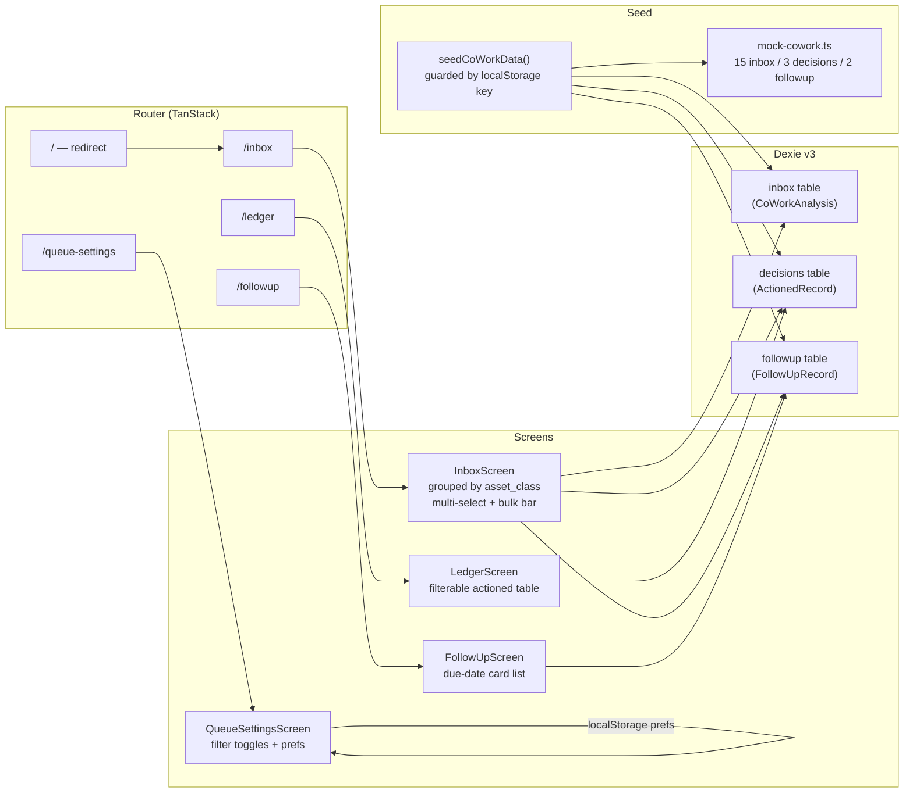
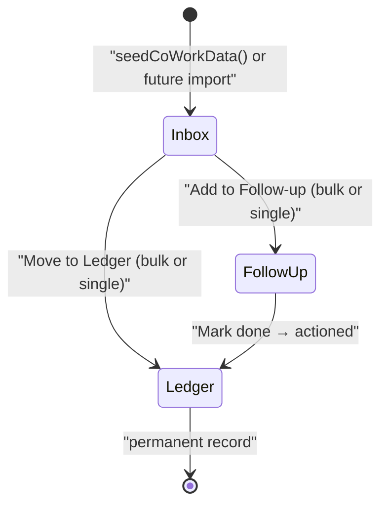

**Size: L**

# CIQ-6 — Queue App Shell and Demo CoWork Dataset

**Technical Release Notes**

## One-line summary

Replaced the Daily/Portfolio navigation with a four-screen Queue App Shell (Analysis Inbox, Decision Ledger, Follow-up Queue, Queue Settings) and introduced the CoWork JSON analysis record as the app's primary data model, with 15-record demo seeding on first load.

---

## Problem being solved

The prior app was built around a Daily Screen / Portfolio split that ranked tickers via Ichimoku-based scoring. On 2026-07-05 the product direction pivoted to a CoWork-style JSON decision queue, where analysis records flow from an Inbox through actioning (Ledger) and monitoring (Follow-up Queue). No existing code supported this model: the navigation, types, database schema, routes, and screen components all had to be replaced from scratch.

---

## Architecture — Before and After

| Aspect | Before | After |
|--------|--------|-------|
| Top-level navigation | Daily Screen, Briefing, Memory, Portfolio, MCP Setup (5 items) | Analysis Inbox, Decision Ledger, Follow-up Queue, Queue Settings (4 items) |
| Default route (`/`) | `DailyScreen` component | Redirect to `/inbox` via TanStack Router `beforeLoad` |
| Primary data model | `Ticker` row with Ichimoku scoring fields | `CoWorkAnalysis` envelope: `{id, ticker, asset_class, exchange, color_band, signal_label, suggested_action, analyst_note, analysed_at}` |
| Dexie schema version | v2 (holdings, recommendations, monitoring_log) | v3 — additive: adds `inbox`, `decisions`, `followup` tables alongside existing v1/v2 tables |
| Mock data source | `src/data/mock-tickers.ts` — 98 tickers, Ichimoku/options scoring | `src/data/mock-cowork.ts` — 15 inbox records, 3 actioned decisions, 2 follow-up records |
| Seed mechanism | None (tickers loaded directly) | `seedCoWorkData()` guard via `convictioniq_cowork_seed_v1` localStorage key — runs once on first load, idempotent |
| Screen components | DailyScreen, Portfolio, Briefing, Memory, MCP-Setup | InboxScreen, LedgerScreen, FollowUpScreen, QueueSettingsScreen |

---

## File changes

| File | Change | Notes |
|------|--------|-------|
| `src/lib/types.ts` | Added | `CoWorkAnalysis`, `ActionedRecord`, `FollowUpRecord` type definitions |
| `src/lib/db.ts` | Modified | Dexie v3 schema — new `inbox`, `decisions`, `followup` tables; `seedCoWorkData()` function |
| `src/data/mock-cowork.ts` | Added | 15 `MOCK_INBOX` records (5 US options, 4 SG stocks, 4 HK stocks, 2 crypto), `MOCK_DECISIONS` (3), `MOCK_FOLLOWUP` (2) |
| `src/lib/constants.ts` | Modified | `ROUTES` and `NAV_ITEMS` replaced with 4 Queue App Shell entries |
| `src/routes/index.tsx` | Modified | `beforeLoad` redirect to `/inbox` |
| `src/routes/inbox.tsx` | Added | Route file for Analysis Inbox |
| `src/routes/ledger.tsx` | Added | Route file for Decision Ledger |
| `src/routes/followup.tsx` | Added | Route file for Follow-up Queue |
| `src/routes/queue-settings.tsx` | Added | Route file for Queue Settings |
| `src/components/Inbox/InboxScreen.tsx` | Added | Records grouped by asset class; checkbox multi-select; sticky bulk action bar (Move to Ledger / Add to Follow-up) |
| `src/components/Ledger/LedgerScreen.tsx` | Added | Filterable table of actioned records by asset class and action type |
| `src/components/FollowUp/FollowUpScreen.tsx` | Added | Card list with due-date labels (Overdue / Due today / Due in Nd); Mark done button |
| `src/components/QueueSettings/QueueSettingsScreen.tsx` | Added | Asset class filter toggles; default view preference persisted to localStorage |
| `src/routes/briefing.tsx` | Deleted | Old Briefing route removed |
| `src/routes/memory.tsx` | Deleted | Old Memory route removed |
| `src/routes/portfolio.tsx` | Deleted | Old Portfolio route removed |
| `src/routes/mcp-setup.tsx` | Deleted | Old MCP Setup route removed |
| `src/components/Briefing/` | Deleted | All files in directory removed |
| `src/components/Memory/` | Deleted | All files in directory removed |
| `src/components/Portfolio/` | Deleted | All files in directory removed |
| `src/components/DailyScreen/` | Deleted | All files in directory removed |

---

## Architecture diagram

_Queue App Shell: how routes, screens, Dexie v3 tables, and the first-load seed relate._

---

## State transitions — CoWork analysis record lifecycle

_Valid state transitions for a CoWork analysis record within the local queue._

---

## Risk and rollback

**Schema migration (Dexie v3):** The migration is additive — `inbox`, `decisions`, and `followup` tables are appended; the existing v1/v2 tables (`holdings`, `recommendations`, `monitoring_log`) are preserved. A user who downgrades to pre-CIQ-6 code will not lose their existing Dexie data; the v3 tables will simply be ignored by the old schema.

**Seed guard:** `seedCoWorkData()` checks `localStorage.getItem("convictioniq_cowork_seed_v1")` before writing. Re-running the app after first load does not duplicate records.

**Deleted screens:** The five removed screen components (`DailyScreen`, `Portfolio`, `Briefing`, `Memory`, `MCP-Setup`) are not referenced anywhere after this change. There is no runtime fallback to them; a hard navigation to their old URLs (e.g. `/portfolio`) will 404 via the TanStack Router's not-found handler.

**Rollback:** Revert the branch. The Dexie v3 tables will persist in IndexedDB on the user's browser until manually cleared or until a schema downgrade is handled; for a local-only prototype this is acceptable.

---

## Test evidence

| Test case | Method | Result |
|-----------|--------|--------|
| TC-001 — `CoWorkAnalysis` type structure | Static analysis (TypeScript compiler) | PASS |
| TC-002 — Dexie v3 schema defined correctly | Static analysis | PASS |
| TC-003 — `seedCoWorkData` guard logic | Static analysis | PASS |
| TC-004 — Mock records cover 4 asset classes | Static analysis | PASS |
| TC-005 — Mock records include all color band values | Static analysis | PASS |
| TC-006 — Mock records include varied signal labels | Static analysis | PASS |
| TC-007 — At least 3 actioned records pre-seeded | Static analysis | PASS |
| TC-008 — NAV_ITEMS contains exactly 4 items | Static analysis | PASS |
| TC-009 — Old routes absent from routes index | Static analysis | PASS |
| TC-010 — Root route redirects to /inbox | Static analysis | PASS |
| TC-011 — InboxScreen imports CoWorkAnalysis type | Static analysis | PASS |
| TC-012 — LedgerScreen renders ActionedRecord type | Static analysis | PASS |
| TC-013 — FollowUpScreen renders FollowUpRecord type | Static analysis | PASS |
| TC-014 — Grouped Inbox renders; bulk action bar activates | **PENDING human verify in browser** | — |
| TC-015 — Seed guard prevents duplicates on reload | **PENDING human verify in browser** | — |
