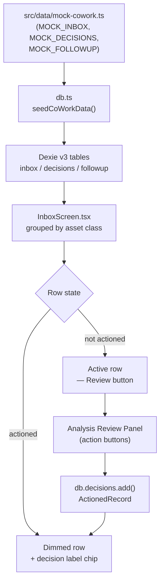
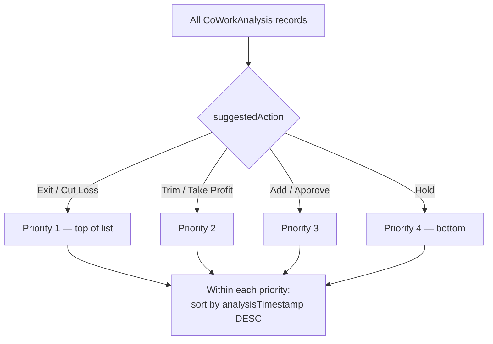

**Size: L**

# CIQ-8 — Build Analysis Inbox Table

## Summary

Replaced the Ichimoku/mock-tickers Daily Screen pipeline with a CoWork-JSON-driven Analysis Inbox as the default working view of ConvictionIQ. The inbox reads mock CoWork analysis records from Dexie v3, groups them by asset class, supports multi-select bulk actions, and opens a per-record Analysis Review Panel for decision capture.

The scope was superseded on 2026-07-05: original ticket ("Integrate Daily Screen Table with Local Data") was closed in favour of the CoWork JSON decision-queue requirement. Implementation discovered that CIQ-6 sprint had already built the majority of the new system; CIQ-8 closed two remaining gaps.

---

## Problem Being Solved

The existing Daily Screen rendered composite-scored tickers from `src/data/mock-tickers.ts` via an Ichimoku scoring pipeline. This pipeline was incompatible with the new CoWork JSON workflow, where analysis files are generated externally and imported for operator review and decisioning. The inbox needed to:

1. Present one row per CoWork analysis record (not one row per ticker).
2. Sort records by actionability priority (Exit first, Hold last).
3. Persist operator decisions to a local Dexie store.
4. Dim and label rows that have already been actioned.

---

## Architecture: Before and After

| Aspect | Before (Daily Screen) | After (Analysis Inbox) |
|---|---|---|
| Data source | `src/data/mock-tickers.ts` (30–50 static ticker rows) | `src/data/mock-cowork.ts` (15 mock CoWorkAnalysis records) seeded into Dexie `inbox` table |
| Default route | `/` rendered `DailyScreen` | `/` redirects to `/inbox`; `InboxScreen` at `/inbox` |
| Scoring pipeline | Ichimoku composite score → ranked table | CoWork JSON `suggestedAction` field → priority sort |
| Decision persistence | None | Dexie v3 `decisions` table, `ActionedRecord` type |
| Row state | Stateless | Actioned rows dimmed + decision label shown |
| Header controls | Calendar date, Advance day, Sync, Refresh, Reset | Cleaned; legacy DailyScreen controls removed |
| Navigation | Legacy nav | `NAV_ITEMS`: Analysis Inbox, Decision Ledger, Follow-up Queue, Queue Settings |

---

## Data Flow


_Mock data seeds Dexie on app mount; InboxScreen reads from Dexie and reflects decision state in real time._

---

## Inbox Row Sort Order


_Within each priority bucket rows are ordered newest-first._

---

## Schema: CoWorkAnalysis Interface and SuggestedAction Union

**`src/lib/types.ts`** — canonical contract for CoWork JSON records:

```typescript
// SuggestedAction union — added in CIQ-8
type SuggestedAction =
  | "Add / Approve"
  | "Hold"
  | "Trim / Take Profit"
  | "Exit / Cut Loss";

interface CoWorkAnalysis {
  id: string;
  ticker: string;
  assetClass: string;
  subType: string;
  strategy: string;
  signalLabel: string;           // SELL PUT | WATCH | WATCHLIST | AVOID | EXIT ALERT
  colorBand: ColorBand;          // Super Green | Light Green | Pink | Super Red
  suggestedAction: SuggestedAction;
  analysisTimestamp: string;     // ISO 8601
  analysisBody: string;          // markdown prose from CoWork
}
```

File naming convention for future live sync: `cowork-analysis-YYYY-MM-DD.json`

---

## Dexie v3 Tables

**`src/lib/db.ts`** — three tables added/migrated:

| Table | Record type | Key | Purpose |
|---|---|---|---|
| `inbox` | `CoWorkAnalysis` | `id` | Pending analysis records to review |
| `decisions` | `ActionedRecord` | `id` | Operator decisions (action + notes + timestamp) |
| `followup` | `FollowupRecord` | `id` | Scheduled follow-up reminders |

`seedCoWorkData()` is called once on app mount from `src/routes/__root.tsx`. It writes `MOCK_INBOX`, `MOCK_DECISIONS`, and `MOCK_FOLLOWUP` into Dexie if the tables are empty.

---

## File Changes

| File | Change | Notes |
|---|---|---|
| `src/lib/types.ts` | Added `SuggestedAction` union + `CoWorkAnalysis` interface | Canonical CoWork JSON contract; CIQ-8 gap closure |
| `src/data/mock-cowork.ts` | New file — `MOCK_INBOX` (15 records), `MOCK_DECISIONS`, `MOCK_FOLLOWUP` | Mirrors mock-tickers.ts pattern; static TS module |
| `src/lib/db.ts` | Dexie v3 schema — `inbox`, `decisions`, `followup` tables + `seedCoWorkData()` | Built in CIQ-6; no changes in CIQ-8 |
| `src/routes/__root.tsx` | Calls `seedCoWorkData()` on mount | Seeds local Dexie on first load |
| `src/routes/index.tsx` | Redirects `/` → `/inbox` | Removes Daily Screen as default route |
| `src/routes/inbox.tsx` | New route — `InboxScreen` at `/inbox` | Entry point for the Analysis Inbox view |
| `src/components/Inbox/InboxScreen.tsx` | Main inbox UI — grouped by asset class, checkbox multi-select, bulk actions | Built in CIQ-6; Review button triggers Analysis Review Panel |
| `src/lib/constants.ts` | `NAV_ITEMS` updated — Analysis Inbox, Decision Ledger, Follow-up Queue, Queue Settings | Replaces legacy Daily Screen nav item |
| `src/components/AppHeader.tsx` | Removed Calendar date, Advance day, Sync, Refresh, Reset controls | CIQ-8 gap closure — legacy DailyScreen controls stripped |

---

## Key Design Decisions

| Decision | Options Considered | Chosen | Rationale |
|---|---|---|---|
| Data loading (Q1) | Filesystem read vs. static mock TS module | Static mock (`src/data/mock-cowork.ts`) | Local-only prototype — no filesystem API in browser; mirrors existing mock-tickers.ts pattern |
| Decision persistence (Q2) | Session state vs. Dexie v3 | Dexie v3 `decisions` table | Survives page refresh; consistent with existing db.ts pattern |
| Routing (Q4) | Add as `/inbox` alongside `/` vs. replace `/` | `/` redirects to `/inbox`; DailyScreen removed | Reduces navigation confusion; clean break from old pipeline |
| Analysis Review Panel (Q5) | Read-only vs. interactive with save | Interactive — decision saved to Dexie | Needed for actioned-row state; core to the decision-queue workflow |
| CoWork JSON schema (Q3) | Derive from file naming vs. define canonical TS interface | `CoWorkAnalysis` in `src/lib/types.ts` | Single source of truth; future live-sync can validate against this interface |

---

## Risk and Rollback

**Risk:** Dexie seed runs unconditionally on app mount. If `MOCK_INBOX` changes between versions, stale Dexie data from a previous session may shadow the new mock records until IndexedDB is cleared.

**Mitigation:** `seedCoWorkData()` only writes if tables are empty. Full reset: open DevTools → Application → IndexedDB → delete `ConvictionIQ` database.

**Rollback:** Revert `src/routes/index.tsx` redirect to restore Daily Screen at `/`. The `inbox.tsx` route and `InboxScreen` component are additive and do not break other routes if left in place.

---

## Test Evidence

- **TypeScript:** `npx tsc --noEmit` — clean, zero errors.
- **Forge auto-checks:** Pass — 8/8.
- **Browser verification (4 checks, user-verified):**
  1. Analysis Inbox renders 15 mock rows grouped by asset class.
  2. Sort order matches priority table (Exit / Cut Loss rows first).
  3. Actioned rows dimmed with decision label visible.
  4. Review button opens Analysis Review Panel for the correct record.
