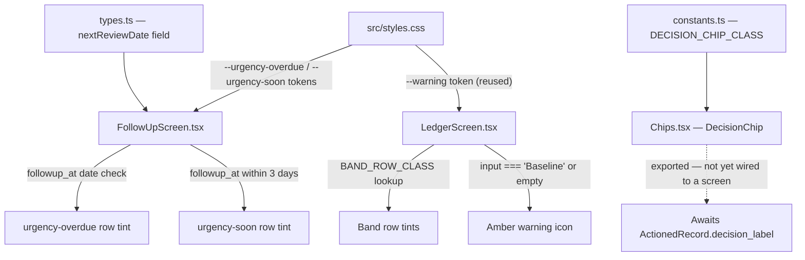

# CIQ-9 — Implement Queue Visual States and Status Badges

**Size: L** | **Audience: Technical** | **Tag: a**

## Summary

Implemented consistent visual states across Analysis Inbox, Decision Ledger, and Follow-up Queue: CSS urgency tokens, signal-label and decision-label badge components, band row tints, actioned-row dimming, follow-up date urgency tints, and an amber warning icon for reasoning bullets that reference unnamed inputs.

---

## Problem Being Solved

The Decision Queue workflow surfaces three screens to the user — Analysis Inbox, Decision Ledger, and Follow-up Queue — but they previously had no shared visual language for decision status or urgency. Engineers building on these screens had no token contract to depend on, and users had no consistent cue to understand which items required attention.

---

## Architecture / Before & After

| Aspect | Before | After |
|--------|--------|-------|
| Urgency row tints | None — all rows rendered identically | `urgency-overdue` (amber, 50% alpha) and `urgency-soon` (yellow, 35% alpha) CSS tokens + utility classes |
| Decision label rendering | Plain text or ad-hoc styling | `DecisionChip` component consuming `DECISION_CHIP_CLASS` constant map with two-tier colour logic |
| `RecommendationRecord` type | No date field for follow-up scheduling | `nextReviewDate?: string` field added; DB schema column `followup_at` wired to urgency tints |
| Reasoning bullet warnings | No indication when scoring input was unnamed | Amber `⚠` icon rendered when `input === "Baseline"` or `input === ""` in the Analyst Note column |
| Band row tints in Ledger | Absent | `BAND_ROW_CLASS` lookup applied per colour band on each LedgerScreen row |

---

## File Changes

| File | Change |
|------|--------|
| `src/styles.css` | Added `--urgency-overdue: oklch(0.36 0.12 50 / 0.50)`, `--urgency-soon: oklch(0.36 0.09 85 / 0.35)` CSS custom properties; `@theme` inline mappings; `@utility` classes `urgency-overdue` and `urgency-soon` |
| `src/lib/constants.ts` | Added `DECISION_CHIP_CLASS` map — 6 decision labels keyed to Tailwind class strings: Accepted/Modified → green, Rejected/Watch Only → amber, Closed/Lesson Learned → gray |
| `src/lib/types.ts` | Added `nextReviewDate?: string` to `RecommendationRecord` interface |
| `src/components/Chips.tsx` | New `DecisionChip` component — accepts `label: DecisionLabel` prop, applies class from `DECISION_CHIP_CLASS`, renders as a styled `` chip |
| `src/components/Ledger/LedgerScreen.tsx` | Applied `BAND_ROW_CLASS` per row; added Analyst Note column with amber `⚠` icon guard on `input === "Baseline"` or `input === ""`; dimmed styling for actioned rows |
| `src/components/FollowUp/FollowUpScreen.tsx` | Row urgency tint applied via `followup_at` date comparison: overdue → `urgency-overdue`, within 3 days → `urgency-soon` |

---

## Visual Diagram

_Token and component dependency graph for the CIQ-9 visual state system. Dashed edge marks the known gap where `DecisionChip` is exported but not yet consumed._

---

## Decision Table — Urgency Tint Rules

| `followup_at` relative to today | Row tint applied | CSS token |
|---------------------------------|-----------------|-----------|
| Overdue (date < today) | Amber — 50% alpha | `--urgency-overdue` |
| Today (date === today) | Amber — 50% alpha | `--urgency-overdue` |
| Within 3 days (date ≤ today + 3) | Yellow — 35% alpha | `--urgency-soon` |
| More than 3 days away | No tint | — |

## Decision Table — DecisionChip Colour Tiers

| Decision label | Colour tier | Class group |
|----------------|-------------|-------------|
| Accepted | Green | `DECISION_CHIP_CLASS["Accepted"]` |
| Modified | Green | `DECISION_CHIP_CLASS["Modified"]` |
| Rejected | Amber | `DECISION_CHIP_CLASS["Rejected"]` |
| Watch Only | Amber | `DECISION_CHIP_CLASS["Watch Only"]` |
| Closed | Gray | `DECISION_CHIP_CLASS["Closed"]` |
| Lesson Learned | Gray | `DECISION_CHIP_CLASS["Lesson Learned"]` |

## Decision Table — Analyst Note Warning Icon

| `input` value | Warning icon shown |
|---------------|--------------------|
| `"Baseline"` | Yes — amber `⚠` |
| `""` (empty string) | Yes — amber `⚠` |
| Any of 13 named dimensions | No |

Named dimensions that suppress the icon: Regime, Kijun Distance, Tenkan/Kijun, Cloud Thickness, Options Yield, Options DTE, Composite Score, Kumo Distance, Earnings Window, Strike Proximity, Options Chain, Portfolio Exposure, Volatility.

---

## Risk and Rollback

**Risk level: Low.** All changes are additive — new CSS tokens, a new component, and a new optional field on an existing type. No existing data is mutated; no API contracts change; the local IndexedDB schema adds a nullable column.

**Known gaps:**
1. `DecisionChip` is exported but not yet wired into any screen — it will have no visible effect until `ActionedRecord` is extended with a `decision_label` field (follow-up ticket).
2. `nextReviewDate` date picker UI widget is deferred — field is present in types and DB but the user cannot yet set it from the UI.
3. TC-012 (amber warning icon visual in dark mode) requires a human eye on the dev server; automated test coverage is 11/12.

**Rollback:** Revert commits `b75c49c` and `1383afa` on `chore/release-v0.1.0`. No data migration is required — the `nextReviewDate` field is optional and nullable; existing records are unaffected.

---

## Test Evidence

Forge test suite: **11/12 test cases passed** on commits `b75c49c` + `1383afa`.

| Test case | Result |
|-----------|--------|
| TC-001 through TC-011 | Pass |
| TC-012 — amber warning icon visual in dark mode | Browser-only; requires human verification on dev server |
